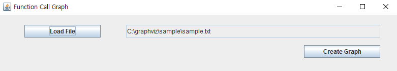
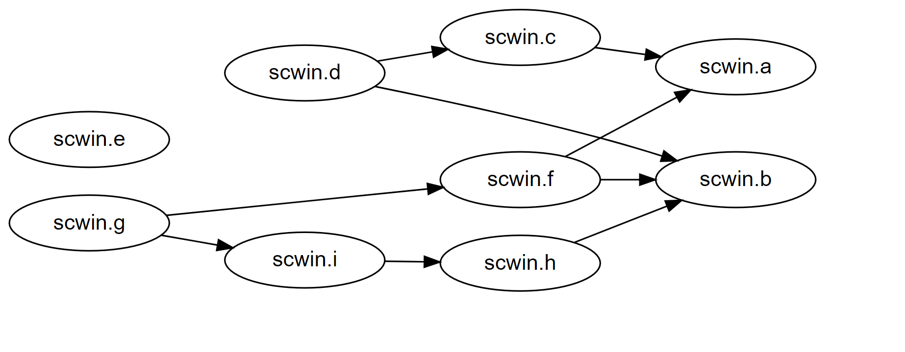

# Draw Function Call Graph With graphviz
I made simple program for drawing function call graph with GraphViz. 

## Result






## Sample File

This is my sample source file. this is syntax of my company's in-house front-end engine. It's based on javascript. Javascript is interpreter language so I read all text and extract function by using only `substring`, `indexof` and `lastindexof`.
```javascript


scwin.a = function(a1, a2){
	...
	blah blah
	...
}


/* scwin.b()'s comment */
scwin.b = async function(b1, b2){
	// scwin.b blah blah
}

// scwin.c()'s comment
scwin.c = function(){
	
	var c = scwin.a(); /*scwin.a()'s comment*/
}

scwin.d = 
function(){
	var d = scwin.b(t,d);
	scwin.c();//scwin.c()'s comment
}

scwin.e = 
function(){
	/*scwin.e()'s comment*/
}

scwin.f = function(){
	scwin.a();
	scwin.b();
}

scwin.g = function(){
	scwin.f();
	scwin.i();
}

scwin.h = function(){
	scwin.b();
}

scwin.i = function(){
	scwin.h();
}
```

## Source code

When You click "Create Graph", this method is called. If you want to change the way of extracting functions and mapping functions, modify `getFunctions` and `getFunctionMap` method.
```java
  public void drawGraph(String filePath, String fileName) {

        String textInFile = getFileText(filePath); // get text from source file.
        ArrayList<String> functions = getFunctions(textInFile); // get defined function
        HashMap<String,ArrayList<String>> functionMap = getFunctionMap(functions,textInFile);
        drawNode(functionMap,fileName); // draw graph
        
    }
```
